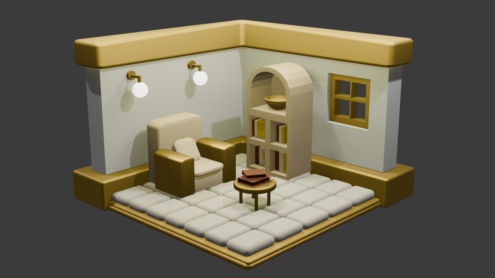

# Blender Isometric Reading Corner

This project is an isometric reading corner environment designed using **Blender**.
The scene focuses on creating a calm and aesthetic interior space while applying fundamental 3D modeling, material creation, lighting, and rendering techniques.

## Project Preview

---

## Project Overview

The goal of this project is to build a simple yet visually appealing reading corner environment.
During the creation process, different Blender tools and workflows were used to design the scene, organize objects, apply materials, and produce a final render.

This project demonstrates the ability to create and manage a small 3D environment from modeling to final rendering.

---

## Skills and Concepts Learned

By completing this project, the following Blender skills and concepts were practiced and applied.

### 3D Modeling and Scene Setup

* Basic mesh modeling using primitives such as **Cube, Plane, and Cylinder**
* Working with **Edit Mode** operations including:

  * Move
  * Scale
  * Rotate
  * Extrude
  * Inset
  * Loop Cut
* Understanding **scene scale and object proportions**
* Organizing the scene using **Outliner and Collections**

### Modifier Usage

* Applying modifiers to simplify modeling workflows
* Understanding how modifiers affect object geometry

### Material Creation

* Assigning materials to objects
* Adjusting material properties such as:

  * Base Color
  * Roughness
  * Metallic
* Creating and organizing multiple materials within the scene

### Shader Editor and Shading

* Using the **Shader Editor** to control and modify material appearance
* Understanding basic node-based material workflow

### Lighting, Camera, and Rendering

* Setting up scene lighting using different light types such as:

  * Area Light
  * Point Light
* Creating an **isometric camera setup**
* Producing a final render using **Eevee or Cycles**

---

## Tools Used

* **Blender** (3D Modeling and Rendering)

---

## Project Outcome

This project demonstrates the workflow of building a small 3D environment, starting from basic modeling and scene organization to lighting setup and final rendering. The result is a calm and aesthetically pleasing reading corner scene.

